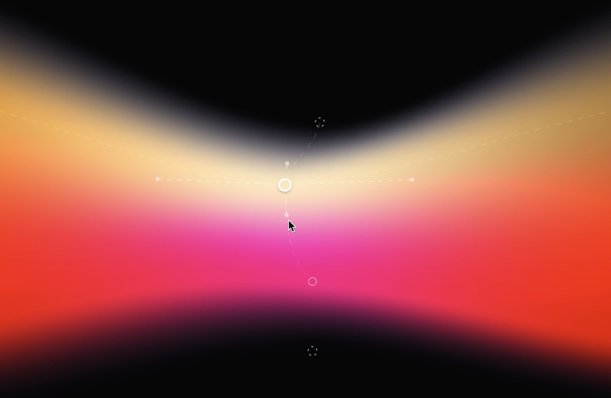

# O'Mesh 🎨

O'Mesh is my take on a free-form mesh gradient implementation.

It is not a JPEG 🌭

## Editors

Applications to design O'Mesh gradients

|Name|Links|Description|
|--|--|--|
|O'Mesh Flutter playground|[web](https://omesh-playground.renan.gg)|A quick playground to create mesh gradients and generate Flutter code ready to use|

## Runtimes

How to run mesh gradients:

|Platforms|Technology|Links|
|--|--|--|
|Android, iOS, Web, macOS, Linux, Windows, ...| Flutter | [pub.dev](https://pub.dev/packages/mesh), [code repository](https://github.com/renancaraujo/omesh/tree/main/flutter/mesh), [live example](https://omesh-flutter.renan.gg) |